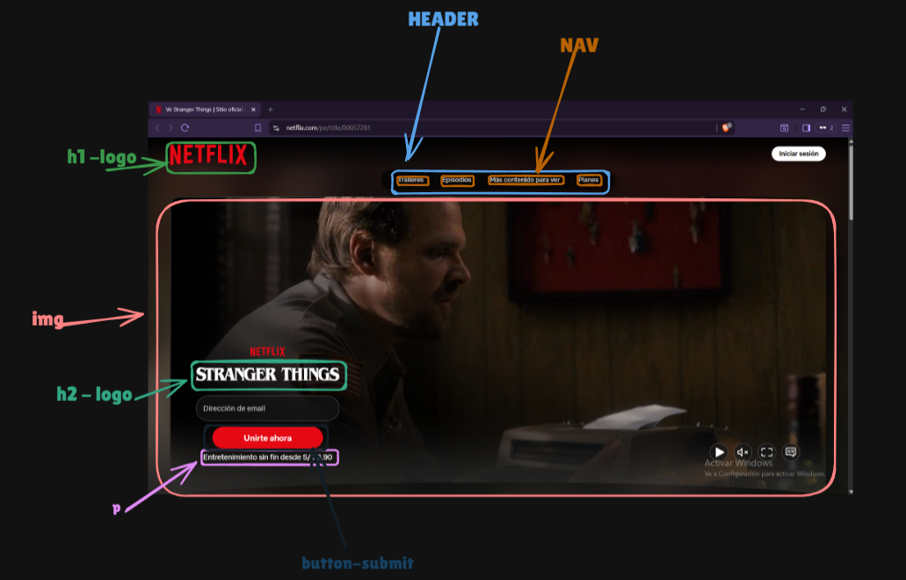

# Instrucciones 
1. van a crear un `Index.html`.
2. escojer una pagina web de su preferencia.
3. estructurar con elementos semanticos de html
la pagina web seleccionada.

# 🧱 Estructuración Semántica en HTML

Este repositorio contiene la resolución de la tarea práctica de maquetación utilizando elementos semánticos de HTML5 basados en una sección real de una plataforma web.

---

## 📋 Desarrollo de la Tarea

### 1. Creación del Archivo
Se ha creado un archivo base llamado `index.html` en la raíz del proyecto para contener toda la estructura del código.

### 2. Página Web Seleccionada
* **Plataforma:** Netflix
* **Sección:** Pantalla de presentación de la serie *Stranger Things*.
* **Motivo de elección:** Cuenta con una interfaz limpia, ideal para identificar bloques de navegación, títulos y elementos multimedia de forma ordenada y secuencial.

### 3. Estructura Semántica Aplicada
El documento se estructuró siguiendo el orden visual de la página (de arriba a abajo) utilizando las siguientes etiquetas semánticas clave:

* **`<header>`**: Contenedor de la barra superior para agrupar la identidad de la página.
* **`<h1>`**: El título de mayor importancia, utilizado para el logotipo principal (NETFLIX).
* **`<nav>`**: Bloque de navegación que agrupa el menú de pestañas centrales.
* **`<main>`**: Define el cuerpo o contenido principal de la sección.
* **`<h2>`**: Título secundario para identificar el nombre del contenido (STRANGER THINGS).
* **`<button>`**: Elemento interactivo para la llamada a la acción ("Unirte ahora").
* **`
`**: Párrafo de texto estándar para los datos secundarios como el precio.
* **``**: Etiqueta huérfana para incrustar la imagen de la casa que va en el fondo.

---

## 🛠️ Tecnologías Utilizadas
* **HTML5:** Para dar una estructura con significado (semántica) al contenido.
* **CSS en línea:** Uso exclusivo del atributo `style` para aplicar los colores corporativos (negro y rojo) de manera introductoria.